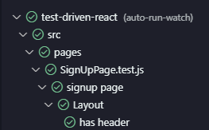
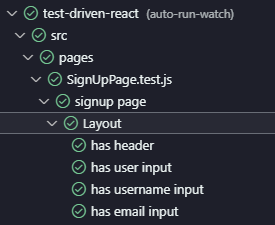
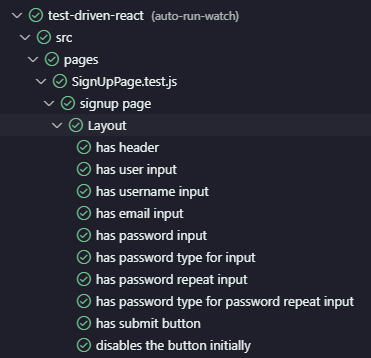
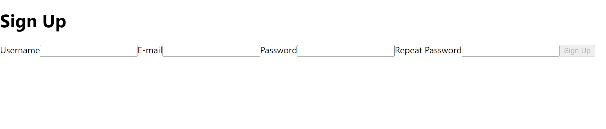

# Sign Up

- [Sign Up](#sign-up)
  - [First Component](#first-component)
    - [SignUp Component](#signup-component)
    - [App Page](#app-page)
    - [SignUp Page Test file](#signup-page-test-file)
    - [remove these files](#remove-these-files)
    - [test output](#test-output)
  - [Layout - Sign Up Form](#layout---sign-up-form)
    - [we can use the container from the render(👎NOT RECOMMENDED)](#we-can-use-the-container-from-the-rendernot-recommended)
    - [SignUp Button](#signup-button)
    - [test result](#test-result)
  - [Form Interactions](#form-interactions)
    - [current output](#current-output)
    - [interactions](#interactions)
  - [Api Request - Sign Up](#api-request---sign-up)
  - [Mocking Mock Service Worker (MSW)](#mocking-mock-service-worker-msw)
  - [Proxy](#proxy)
  - [Styling](#styling)
  - [Progress Indicator](#progress-indicator)
  - [Layout - Sign Up Success](#layout---sign-up-success)
  - [Refactor - Test Lifecycle Async Await](#refactor---test-lifecycle-async-await)

## First Component

### SignUp Component

```jsx
const SignUpPage = ()=>{
  react <h1>Sign Up</h1>
}

export default SignUpPage;

```

### App Page

```jsx
import SignUpPage from './pages/SignUpPage';

function App() {
  return <SignUpPage />;
}

export default App;
```

### SignUp Page Test file

```jsx
import SignUpPage from '../pages/SignUpPage';
import { render, screen } from '@testing-library/react';

describe('signup page', () => {
  describe('Layout', () => {
    it('has header', () => {
      render(<SignUpPage />);
      const header = screen.queryByRole('heading', { name: 'Sign Up' });
      // these are coming from testing library jest-dom
      expect(header).toBeInTheDocument();
    });
  });
});
```

### remove these files

App.css,App.test.js,Logo and etc

### test output



## Layout - Sign Up Form

### we can use the container from the render(👎NOT RECOMMENDED)

```jsx
const SignUpPage = ()=>{
  react <>
  <h1>Sign Up</h1>
  <input/>
  <input/>
  </>
}

export default SignUpPage;

```

```jsx
it('has userName input', () => {
  const { container } = render(<SignUpPage />);
  const input = container.querySelector('input');
  expect(input).toBeInTheDocument();
});

it('has email input', () => {
  const { container } = render(<SignUpPage />);
  // this will return an Array
  const input = container.querySelectorAll('input');
  expect(input.length).toBe(2);
});
```

this is not a good way to test the code.
because these test are not specific and they are tied to the dom structure.
so let's fix this. let's add some place holders to the input.

```jsx
const SignUpPage = ()=>{
  react <>
  <h1>Sign Up</h1>
  <input placeholder="username"/>
  <input placeholder="email"/>
  </>
}

export default SignUpPage;

```

and we wil use screen to test the input.
where we have

- 🥇 queryBy..
- 🥇 getBy...
- 🥇 findBy...

```jsx
it('has userName input', () => {
  render(<SignUpPage />);
  const input = screen.getByPlaceholder('username');
  expect(input).toBeInTheDocument();
});

it('has email input', () => {
  render(<SignUpPage />);
  const input = screen.getByPlaceholder('email');
  expect(input.length).toBe(2);
});
```

and tets are passing.


let's use Labels instead of place holders.

```jsx
const SignUpPage = ()=>{
  react <>
  <h1>Sign Up</h1>
  <input htmlFor="username/>
  <label id="username">Username</label>
  <input htmlFor="email"/>
  <label id="email" >Email</label>
  </>
}

export default SignUpPage;
```

now test will fail because we removed the place holders.

now let's change the test to use the labels.

```jsx
it('has userName input', () => {
  render(<SignUpPage />);
  const input = screen.getByLabelText('Username');
  expect(input).toBeInTheDocument();
});

it('has email input', () => {
  render(<SignUpPage />);
  const input = screen.getByLabelText('Email');
  expect(input.length).toBe(2);
});
```

and add the password test

```jsx
it('has password input', () => {
  render(<SignUpPage />);
  const input = screen.getByLabelText('Password');
  expect(input.length).toBe(2);
});
```

it's failing so let's fix this.

let's add password

```jsx
const SignUpPage = ()=>{
  react <>
  <h1>Sign Up</h1>
  <input htmlFor="username/>
  <label id="username">Username</label>
  <input htmlFor="email"/>
  <label id="email" >Email</label>
  <input htmlFor="password"/>
  <label id="password" >Password</label>
  </>
}

export default SignUpPage;
```

password is not masking
let's write the test for it

```jsx
it('has password type for password input', () => {
  render(<SignUpPage />);
  const input = screen.getByLabelText('Password');
  expect(input.type).toBe('password');
});
```

let's add masking

```jsx
const SignUpPage = ()=>{
  react <>
  <h1>Sign Up</h1>
  <input htmlFor="username/>
  <label id="username">Username</label>
  <input htmlFor="email"/>
  <label id="email" >Email</label>
  <input htmlFor="password"/>
  <label id="password" >Password</label>
  <input type="password" htmlFor="password"/>
  </>
}
```

let's add repeat password
let's write test for it.

```jsx
it('has repeat password input', () => {
  render(<SignUpPage />);
  const input = screen.getByLabelText('Repeat Password');
  expect(input).toBeInTheDocument();
});

it('has password type for repeat password input', () => {
  render(<SignUpPage />);
  const input = screen.getByLabelText('Repeat Password');
  expect(input.type).toBe('password');
});
```

tests are failing so
let's add it to the component

```jsx
const SignUpPage = ()=>{
  react <>
  <h1>Sign Up</h1>
  <input htmlFor="username/>
  <label id="username">Username</label>
  <input htmlFor="email"/>
  <label id="email" >Email</label>
  <input htmlFor="password"/>
  <label id="password" >Password</label>
  <input type="password" htmlFor="password"/>
  <label id="passwordRepeat" >Password</label>
  <input type="password" htmlFor="passwordRepeat"/>
  </>
}
```

### SignUp Button

let's add signUp Button
let's write the test for it

```jsx
it('has submit button', () => {
  render(<SignUpPage />);
  const button = screen.queryByRole('button', { name: 'Sign Up' });
  expect(button).toBeInTheDocument();
});
```

so the test it failing.
let's add the button.

```jsx
const SignUpPage = ()=>{
  react <>
  <h1>Sign Up</h1>
  <input htmlFor="username/>
  <label id="username">Username</label>
  <input htmlFor="email"/>
  <label id="email" >Email</label>
  <input htmlFor="password"/>
  <label id="password" >Password</label>
  <input type="password" htmlFor="password"/>
  <label id="passwordRepeat" >Password</label>
  <input type="password" htmlFor="passwordRepeat"/>
  <button>Sign Up</button>
  </>
}
```

let's test if the button is disabled initially

```jsx
it('disabled the button initially', () => {
  render(<SignUpPage />);
  const button = screen.queryByRole('button', { name: 'Sign Up' });
  expect(button).toBeDisabled();
});
```

add the functionality

```jsx
<button disabled>Sign Up</button>
```

### test result



## Form Interactions

### current output



### interactions

let's write test for the interactions

let's write a test to check if the password and repeat password are same button get enabled.

```jsx

  describe('interactions', () => {
    it('enables the button when the password and repeat password match', () => {
      render(<SignUpPage />);
      const button = screen.getByRole('button', { name: 'Sign Up' });
      const passwordInput = screen.getByLabelText('Password');
      const repeatPasswordInput = screen.getByLabelText('Repeat Password');
      userEvent.type(passwordInput, 'password');
      userEvent.type(repeatPasswordInput, 'password');
      expect(button).not.toBeDisabled();
    });
  });
```

this will fail because the button is disabled.

let's implement the functionality.

let's use hooks for this.

```jsx
  const [password, setPassword] = useState("");
  const [confirmPassword, setConfirmPassword] = useState("");
  const [disabled, setDisabled] = useState(true);

  
  const onChange = (e) => {
    const { value, id } = e.target;
    if (id === "password") {
      setPassword(value);
    }
    if (id === "repeat-password") {
      setConfirmPassword(value);
    }
    if (id === "email") {
      setEmail(value);
    }
    if (id === "username") {
      setUser(value);
    }
  };

    useEffect(() => {
    if (
      password.length > 0 &&
      confirmPassword.length > 0 &&
      password === confirmPassword
    ) {
      setDisabled(false);
    } else {
      setDisabled(true);
    }
  }, [confirmPassword, confirmPassword.length, password, password.length]);

    return (
    <>
      <form>
        <h1>Sign Up</h1>
        <label htmlFor="username">Username</label>
        <input id="username" onChange={onChange} />
        <label htmlFor="email">E-mail</label>
        <input id="email" onChange={onChange} />
        <label htmlFor="password">Password</label>
        <input id="password" type={"password"} onChange={onChange} />
        <label htmlFor="repeat-password">Repeat Password</label>
        <input type="password" id="repeat-password" onChange={onChange} />
        <button disabled={disabled} type="submit" onClick={onClick}>
          Sign Up
        </button>
      </form>
    </>
  );
```

## Api Request - Sign Up

let's make api calls for sign up
 we will install axios  and use it to make api calls.

```shell
npm i axios
```

 let's write the test for it

```jsx
  it('send username, password, email to the backend', () => {
      render(<SignUpPage />);
      const usernameInput = screen.getByLabelText('Username');
      const emailInput = screen.getByLabelText('E-mail');
      const passwordInput = screen.getByLabelText('Password');
      const repeatPasswordInput = screen.getByLabelText('Repeat Password');
      userEvent.type(usernameInput, 'username');
      userEvent.type(emailInput, 'abc@gmail.com');
      userEvent.type(passwordInput, 'password');
      userEvent.type(repeatPasswordInput, 'password');
      const button = screen.getByRole('button', { name: 'Sign Up' });
      const mockFn = jest.fn();
      axios.post = mockFn;
      userEvent.click(button);
      const firstCallOfTheMockFunction = mockFn.mock.calls[0];
      const body = firstCallOfTheMockFunction[1];
      expect(body).toEqual({
        username: 'username',
        email: 'abc@gmail.com',
        password: 'password',
      });
    });

```

test will fail

let's implement the code

```jsx
<button disabled={disabled} type="submit" onClick={onClick}>
  Sign Up
</button>
```

let's write a onClick method

```jsx
import axios from "axios";
import { useEffect, useState } from "react";

// state to save the user and email
const [user, setUser] = useState("");
const [email, setEmail] = useState("");

const onClick = (event) => {
    event.preventDefault();
    const body = {
      username: user,
      email,
      password,
    };
    axios.post("http://localhost:5000/api/users/signup", body);
};
```

we can't make a real api call in the test.
because we should be able to run the app without a backend.
for the test

we are going to use the mock function from jest

```jsx
const mockFn = jest.fn();
```

so after clicking the button the mock function will be called
and let's mock this post functionality

```jsx
axios.post = mockFn;
```

let's click the button

```jsx
userEvent.click(button);
```

this mock function has mock object which has a call array.
which has the call history of the function.

so we are looking for the first call

```jsx
const firstCallOfTheMockFunction = mockFn.mock.calls[0];
```

from this we can access the parameters of the function.
first param is the url,but we need the body.

```jsx
 const body = firstCallOfTheMockFunction[1];
```

now we can do the assertion part

```jsx
 expect(body).toEqual({
        username: 'username',
        email: 'abc@gmail.com',
        password: 'password',
      });
```

## Mocking Mock Service Worker (MSW)

## Proxy

## Styling

## Progress Indicator

## Layout - Sign Up Success

## Refactor - Test Lifecycle Async Await
