# Sign Up

- [Sign Up](#sign-up)
  - [First Component](#first-component)
    - [SignUp Component](#signup-component)
    - [App Page](#app-page)
    - [SignUp Page Test file](#signup-page-test-file)
    - [remove these files](#remove-these-files)
    - [test output](#test-output)
  - [Layout - Sign Up Form](#layout---sign-up-form)
    - [we can use the container from the render(👎NOT RECOMMENDED)](#we-can-use-the-container-from-the-rendernot-recommended)
    - [using container to get the input(📛 practice)](#using-container-to-get-the-input-practice)
    - [using place holder text to get the element(😁 practice)](#using-place-holder-text-to-get-the-element-practice)
    - [three main way to find the elements 🔎](#three-main-way-to-find-the-elements-)
    - [Testing library short note 🧪](#testing-library-short-note-)
      - [search variants](#search-variants)
      - [render a component](#render-a-component)
      - [search the dom](#search-the-dom)
      - [search types](#search-types)
      - [wait for the appearance](#wait-for-the-appearance)
      - [render options](#render-options)
    - [SignUp Button](#signup-button)
    - [test result](#test-result)
  - [Form Interactions](#form-interactions)
    - [current output](#current-output)
    - [interactions](#interactions)
  - [Api Request - Sign Up](#api-request---sign-up)
    - [mock functions from jest](#mock-functions-from-jest)
  - [Mocking Mock Service Worker (MSW)](#mocking-mock-service-worker-msw)
    - [Mocking Mock Service Worker (MSW)](#mocking-mock-service-worker-msw-1)
    - [msw](#msw)
  - [Proxy](#proxy)
    - [proxy setup](#proxy-setup)
  - [Styling](#styling)
    - [removing index css file](#removing-index-css-file)
    - [adding bootstrap as a cdn link](#adding-bootstrap-as-a-cdn-link)
    - [implementing bootstrap to the signUp page](#implementing-bootstrap-to-the-signup-page)
    - [output](#output)
  - [Progress Indicator](#progress-indicator)
  - [Layout - Sign Up Success](#layout---sign-up-success)
  - [Refactor - Test Lifecycle Async Await](#refactor---test-lifecycle-async-await)

## First Component

### SignUp Component

```jsx
const SignUpPage = ()=>{
  react <h1>Sign Up</h1>
}

export default SignUpPage;

```

### App Page

```jsx
import SignUpPage from './pages/SignUpPage';

function App() {
  return <SignUpPage />;
}

export default App;
```

### SignUp Page Test file

```jsx
import SignUpPage from '../pages/SignUpPage';
import { render, screen } from '@testing-library/react';

describe('signup page', () => {
  describe('Layout', () => {
    it('has header', () => {
      render(<SignUpPage />);
      const header = screen.queryByRole('heading', { name: 'Sign Up' });
      // these are coming from testing library jest-dom
      expect(header).toBeInTheDocument();
    });
  });
});
```

### remove these files

App.css,App.test.js,Logo and etc

### test output


## Layout - Sign Up Form

### we can use the container from the render(👎NOT RECOMMENDED)

```jsx
const SignUpPage = ()=>{
  react <>
  <h1>Sign Up</h1>
  <input/>
  <input/>
  </>
}

export default SignUpPage;

```

### using container to get the input(📛 practice)

```jsx
it('has userName input', () => {
  const { container } = render(<SignUpPage />);
  const input = container.querySelector('input');
  expect(input).toBeInTheDocument();
});

it('has email input', () => {
  const { container } = render(<SignUpPage />);
  // this will return an Array
  const input = container.querySelectorAll('input');
  expect(input.length).toBe(2);
});
```

### using place holder text to get the element(😁 practice)

this is not a good way to test the code.
because these test are specific to the way dom is rendered. if we change the order the test will fail.
so let's fix this. let's add some place holders to the input.

```jsx
const SignUpPage = ()=>{
  react <>
  <h1>Sign Up</h1>
  <input placeholder="username"/>
  <input placeholder="email"/>
  </>
}

export default SignUpPage;

```

### three main way to find the elements 🔎

and we wil use screen to test the input.
where we have

- 🥇 queryBy..
- 🥇 getBy...
- 🥇 findBy...

### Testing library short note 🧪

[detail link](https://testing-library.com/docs/react-testing-library/cheatsheet)

#### search variants

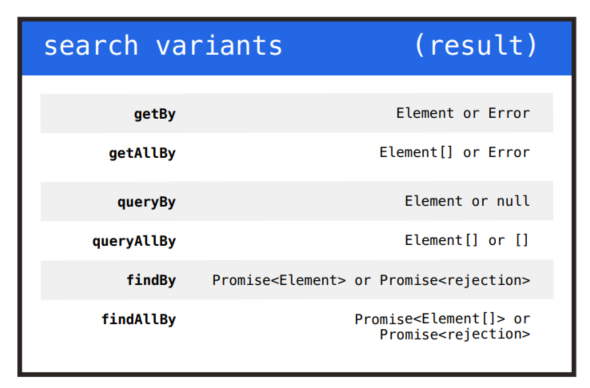

#### render a component

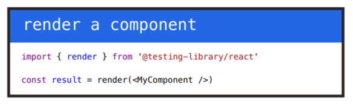

#### search the dom

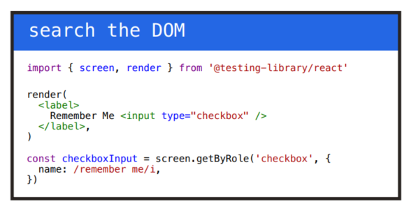

#### search types

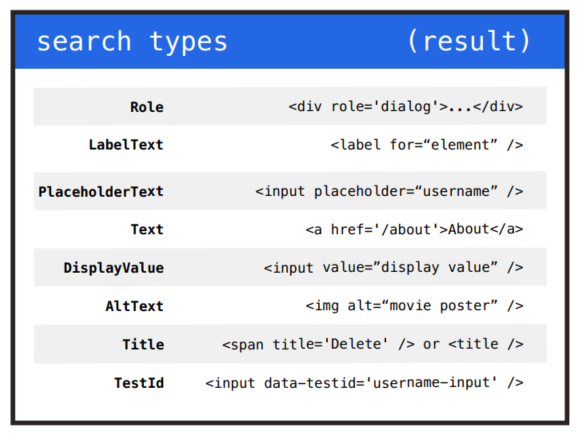

#### wait for the appearance

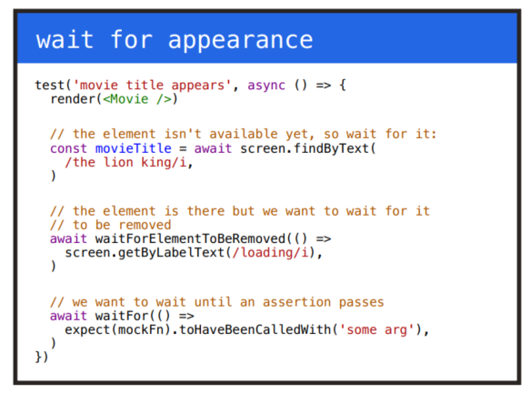

#### render options

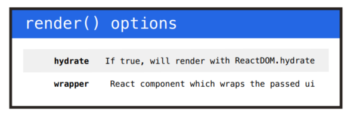

```jsx
it('has userName input', () => {
  render(<SignUpPage />);
  const input = screen.getByPlaceholder('username');
  expect(input).toBeInTheDocument();
});

it('has email input', () => {
  render(<SignUpPage />);
  const input = screen.getByPlaceholder('email');
  expect(input.length).toBe(2);
});
```

and tets are passing.


let's use Labels instead of place holders.

```jsx
const SignUpPage = ()=>{
  react <>
  <h1>Sign Up</h1>
  <input htmlFor="username/>
  <label id="username">Username</label>
  <input htmlFor="email"/>
  <label id="email" >Email</label>
  </>
}

export default SignUpPage;
```

now test will fail because we removed the place holders.

now let's change the test to use the labels.

```jsx
it('has userName input', () => {
  render(<SignUpPage />);
  const input = screen.getByLabelText('Username');
  expect(input).toBeInTheDocument();
});

it('has email input', () => {
  render(<SignUpPage />);
  const input = screen.getByLabelText('Email');
  expect(input.length).toBe(2);
});
```

and add the password test

```jsx
it('has password input', () => {
  render(<SignUpPage />);
  const input = screen.getByLabelText('Password');
  expect(input.length).toBe(2);
});
```

it's failing so let's fix this.

let's add password

```jsx
const SignUpPage = ()=>{
  react <>
  <h1>Sign Up</h1>
  <input htmlFor="username/>
  <label id="username">Username</label>
  <input htmlFor="email"/>
  <label id="email" >Email</label>
  <input htmlFor="password"/>
  <label id="password" >Password</label>
  </>
}

export default SignUpPage;
```

password is not masking
let's write the test for it

```jsx
it('has password type for password input', () => {
  render(<SignUpPage />);
  const input = screen.getByLabelText('Password');
  expect(input.type).toBe('password');
});
```

let's add masking

```jsx
const SignUpPage = ()=>{
  react <>
  <h1>Sign Up</h1>
  <input htmlFor="username/>
  <label id="username">Username</label>
  <input htmlFor="email"/>
  <label id="email" >Email</label>
  <input htmlFor="password"/>
  <label id="password" >Password</label>
  <input type="password" htmlFor="password"/>
  </>
}
```

let's add repeat password
let's write test for it.

```jsx
it('has repeat password input', () => {
  render(<SignUpPage />);
  const input = screen.getByLabelText('Repeat Password');
  expect(input).toBeInTheDocument();
});

it('has password type for repeat password input', () => {
  render(<SignUpPage />);
  const input = screen.getByLabelText('Repeat Password');
  expect(input.type).toBe('password');
});
```

tests are failing so
let's add it to the component

```jsx
const SignUpPage = ()=>{
  react <>
  <h1>Sign Up</h1>
  <input htmlFor="username/>
  <label id="username">Username</label>
  <input htmlFor="email"/>
  <label id="email" >Email</label>
  <input htmlFor="password"/>
  <label id="password" >Password</label>
  <input type="password" htmlFor="password"/>
  <label id="passwordRepeat" >Password</label>
  <input type="password" htmlFor="passwordRepeat"/>
  </>
}
```

### SignUp Button

let's add signUp Button
let's write the test for it

```jsx
it('has submit button', () => {
  render(<SignUpPage />);
  const button = screen.queryByRole('button', { name: 'Sign Up' });
  expect(button).toBeInTheDocument();
});
```

so the test it failing.
let's add the button.

```jsx
const SignUpPage = ()=>{
  react <>
  <h1>Sign Up</h1>
  <input htmlFor="username/>
  <label id="username">Username</label>
  <input htmlFor="email"/>
  <label id="email" >Email</label>
  <input htmlFor="password"/>
  <label id="password" >Password</label>
  <input type="password" htmlFor="password"/>
  <label id="passwordRepeat" >Password</label>
  <input type="password" htmlFor="passwordRepeat"/>
  <button>Sign Up</button>
  </>
}
```

let's test if the button is disabled initially

```jsx
it('disabled the button initially', () => {
  render(<SignUpPage />);
  const button = screen.queryByRole('button', { name: 'Sign Up' });
  expect(button).toBeDisabled();
});
```

add the functionality

```jsx
<button disabled>Sign Up</button>
```

### test result


## Form Interactions

### current output


### interactions

let's write test for the interactions

let's write a test to check if the password and repeat password are same button get enabled.

```jsx

  describe('interactions', () => {
    it('enables the button when the password and repeat password match', () => {
      render(<SignUpPage />);
      const button = screen.getByRole('button', { name: 'Sign Up' });
      const passwordInput = screen.getByLabelText('Password');
      const repeatPasswordInput = screen.getByLabelText('Repeat Password');
      userEvent.type(passwordInput, 'password');
      userEvent.type(repeatPasswordInput, 'password');
      expect(button).not.toBeDisabled();
    });
  });
```

this will fail because the button is disabled.

let's implement the functionality.

let's use hooks for this.

```jsx
  const [password, setPassword] = useState("");
  const [confirmPassword, setConfirmPassword] = useState("");
  const [disabled, setDisabled] = useState(true);

  
  const onChange = (e) => {
    const { value, id } = e.target;
    if (id === "password") {
      setPassword(value);
    }
    if (id === "repeat-password") {
      setConfirmPassword(value);
    }
    if (id === "email") {
      setEmail(value);
    }
    if (id === "username") {
      setUser(value);
    }
  };

    useEffect(() => {
    if (
      password.length > 0 &&
      confirmPassword.length > 0 &&
      password === confirmPassword
    ) {
      setDisabled(false);
    } else {
      setDisabled(true);
    }
  }, [confirmPassword, confirmPassword.length, password, password.length]);

    return (
    <>
      <form>
        <h1>Sign Up</h1>
        <label htmlFor="username">Username</label>
        <input id="username" onChange={onChange} />
        <label htmlFor="email">E-mail</label>
        <input id="email" onChange={onChange} />
        <label htmlFor="password">Password</label>
        <input id="password" type={"password"} onChange={onChange} />
        <label htmlFor="repeat-password">Repeat Password</label>
        <input type="password" id="repeat-password" onChange={onChange} />
        <button disabled={disabled} type="submit" onClick={onClick}>
          Sign Up
        </button>
      </form>
    </>
  );
```

## Api Request - Sign Up

let's make api calls for sign up
 we will install axios  and use it to make api calls.

```shell
npm i axios
```

 let's write the test for it

```jsx
  it('send username, password, email to the backend', () => {
      render(<SignUpPage />);
      const usernameInput = screen.getByLabelText('Username');
      const emailInput = screen.getByLabelText('E-mail');
      const passwordInput = screen.getByLabelText('Password');
      const repeatPasswordInput = screen.getByLabelText('Repeat Password');
      userEvent.type(usernameInput, 'username');
      userEvent.type(emailInput, 'abc@gmail.com');
      userEvent.type(passwordInput, 'password');
      userEvent.type(repeatPasswordInput, 'password');
      const button = screen.getByRole('button', { name: 'Sign Up' });
      const mockFn = jest.fn();
      axios.post = mockFn;
      userEvent.click(button);
      const firstCallOfTheMockFunction = mockFn.mock.calls[0];
      const body = firstCallOfTheMockFunction[1];
      expect(body).toEqual({
        username: 'username',
        email: 'abc@gmail.com',
        password: 'password',
      });
    });

```

test will fail

let's implement the code

```jsx
<button disabled={disabled} type="submit" onClick={onClick}>
  Sign Up
</button>
```

let's write a onClick method

```jsx
import axios from "axios";
import { useEffect, useState } from "react";

// state to save the user and email
const [user, setUser] = useState("");
const [email, setEmail] = useState("");

const onClick = async (event) => {
  event.preventDefault(); 
  const body = {
    username: user,
    email,
    password,
  };
  await axios.post("api/1.0/users", body);
};
```

we can't make a real api call in the test.
because we should be able to run the app without a backend.
for the test

### mock functions from jest

we are going to use the mock function from jest

```jsx
const mockFn = jest.fn();
```

so after clicking the button the mock function will be called
and let's mock this post functionality

```jsx
axios.post = mockFn;
```

let's click the button

```jsx
userEvent.click(button);
```

this mock function has mock object which has a call array.
which has the call history of the function.

so we are looking for the first call

```jsx
const firstCallOfTheMockFunction = mockFn.mock.calls[0];
```

from this we can access the parameters of the function.
first param is the url,but we need the body.

```jsx
 const body = firstCallOfTheMockFunction[1];
```

now we can do the assertion part

```jsx
 expect(body).toEqual({
        username: 'username',
        email: 'abc@gmail.com',
        password: 'password',
      });
```

## Mocking Mock Service Worker (MSW)

instead of using the axios we can use the builtin fetch api
let's do that

```jsx
  fetch("api/1.0/users", {
      method: "POST",
      headers: {
        "Content-Type": "application/json",
      },
      body: JSON.stringify(body),
    })
```

so this will behave as same as axios

but now we have to mock fetch api

```jsx
 it('send username, password, email to the backend', () => {
      render(<SignUpPage />);
      const usernameInput = screen.getByLabelText('Username');
      const emailInput = screen.getByLabelText('E-mail');
      const passwordInput = screen.getByLabelText('Password');
      const repeatPasswordInput = screen.getByLabelText('Repeat Password');
      userEvent.type(usernameInput, 'username');
      userEvent.type(emailInput, 'abc@gmail.com');
      userEvent.type(passwordInput, 'password');
      userEvent.type(repeatPasswordInput, 'password');
      const button = screen.getByRole('button', { name: 'Sign Up' });
      const mockFn = jest.fn();
      // axios.post = mockFn;
      // let's mock the fetch function 
      window.fetch = mockFn;
      userEvent.click(button);
      const firstCallOfTheMockFunction = mockFn.mock.calls[0];
      // this firstCallOfTheMockFunction[1] will return a object
      // which is in as a String
      // let's convert it back to js Object before comparison
      const body = JSON.parse(firstCallOfTheMockFunction[1].body);
      expect(body).toEqual({
        username: 'username',
        email: 'abc@gmail.com',
        password: 'password',
      });
    });
 ```

### [Mocking Mock Service Worker (MSW)](https://mswjs.io/)

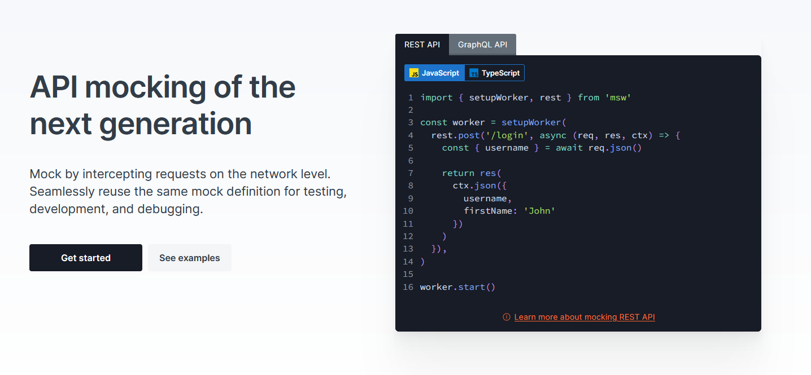

so we can mock the request not api
these are interceptors which will cath the request made by the browser.
as in intercept.
then we can mimic the response.

### msw

let's add the msw dependency

```jsx
npm i -D msw
```

let's implement the msw.
we will remove the mock code from the test

```jsx

import { setupServer } from 'msw/node';
import { rest } from 'msw';

it('send username, password, email to the backend', async () => {
    let requestBody;
    const server = setupServer(
      rest.post("/api/1.0/users", (req, res, ctx) => {
        requestBody = req.body;
        return res(ctx.status(200))
      })
    );
    server.listen()
    render(<SignUpPage />);
    const usernameInput = screen.getByLabelText('Username');
    const emailInput = screen.getByLabelText('E-mail');
    const passwordInput = screen.getByLabelText('Password');
    const repeatPasswordInput = screen.getByLabelText('Repeat Password');
    userEvent.type(usernameInput, 'username');
    userEvent.type(emailInput, 'abc@gmail.com');
    userEvent.type(passwordInput, 'password');
    userEvent.type(repeatPasswordInput, 'password');
    const button = screen.getByRole('button', { name: 'Sign Up' });
    userEvent.click(button);
    await new Promise(resolve => setTimeout(resolve, 500))
    expect(requestBody).toEqual({
      username: 'username',
      email: 'abc@gmail.com',
      password: 'password',
    });
  });
```

- now if we use axios or fetch we don't have to change the test.

- because we are intercepting the request.

- let's confirm that.

- remove the fetch functionally from the code and see if the tests are still passing.

- then we can see tests are not affected.

- with these libraries we can write reliable test cases.

- but the downside is it is tightly coupled with the implementation.

## Proxy

- let's run the backend on memory mode

```shell
npm run start-memo
```

- which will run on port 8080.

- let's add this to the url of the post request.

```jsx
await axios.post("http://localhost:8080/api/1.0/users", body);
```

and test it on the browser
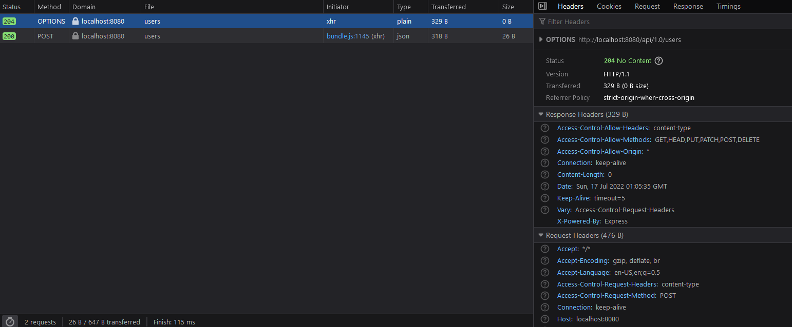

as you can see the browser is sending two requests.

this options request is send by the browser because we are sending a request to a different domain.

this is called Cross Origin Request Sharing.(CORS)

this is sent to the backend to make sure the backend is allowing this request.

### proxy setup

if we want avoid this options request we can use the proxy.

```json
"proxy": "http://localhost:8080"
```

and remove the url part from the post method.

```jsx
 await axios.post("/api/1.0/users", body);
```

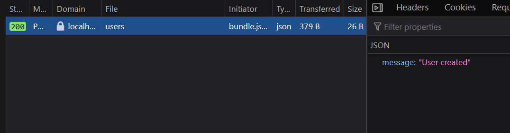

we can see there are no options request.

before the proxy setup

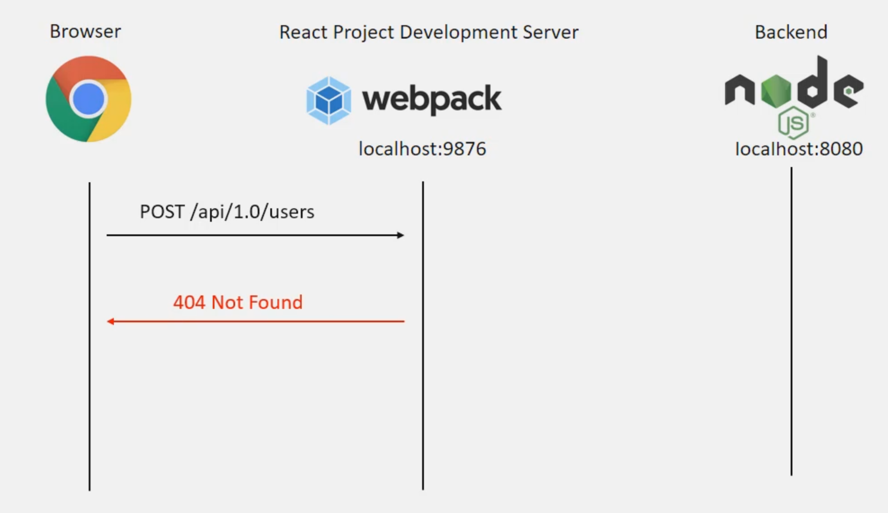

then we setup the proxy.
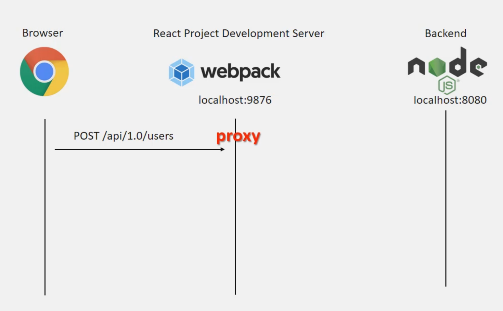

then our request we go to the nodejs server
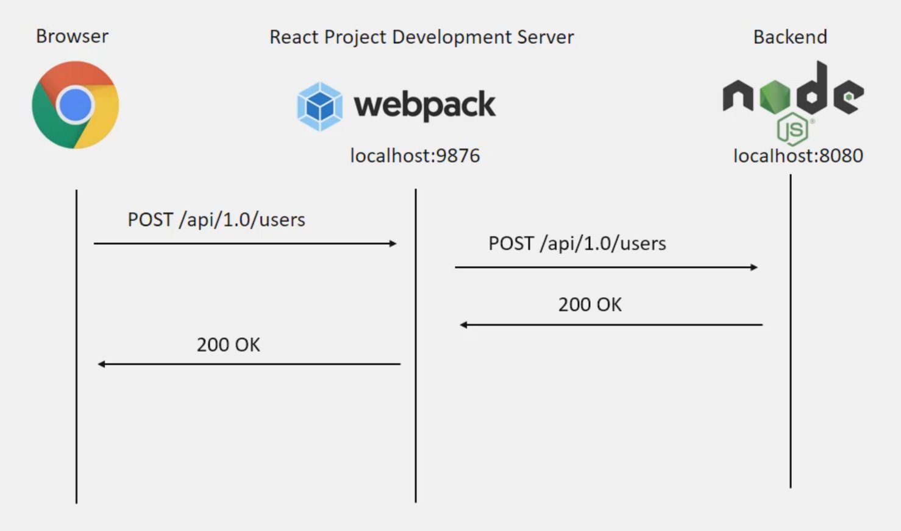

## Styling

### removing index css file

remove the index.css file and remove the import from the index.js file aswel.

### adding bootstrap as a cdn link

add the cdn link to the index.html file.

```html
<link href="https://cdn.jsdelivr.net/npm/bootstrap@5.2.0-beta1/dist/css/bootstrap.min.css" rel="stylesheet" integrity="sha384-0evHe/X+R7YkIZDRvuzKMRqM+OrBnVFBL6DOitfPri4tjfHxaWutUpFmBp4vmVor" crossorigin="anonymous">
    <link rel="apple-touch-icon" href="%PUBLIC_URL%/logo192.png" />
```

### implementing bootstrap to the signUp page

```jsx
import axios from "axios";
import { useEffect, useState } from "react";

const SignUpPage = () => {
  const [user, setUser] = useState("");
  const [email, setEmail] = useState("");
  const [password, setPassword] = useState("");
  const [confirmPassword, setConfirmPassword] = useState("");
  const [disabled, setDisabled] = useState(true);

  const onChange = (e) => {
    const { value, id } = e.target;
    if (id === "password") {
      setPassword(value);
    }
    if (id === "repeat-password") {
      setConfirmPassword(value);
    }
    if (id === "email") {
      setEmail(value);
    }
    if (id === "username") {
      setUser(value);
    }
  };

  const onClick = async (event) => {
    event.preventDefault();
    const body = {
      username: user,
      email,
      password,
    };
    await axios.post("/api/1.0/users", body);

  };

  useEffect(() => {
    if (
      password.length > 0 &&
      confirmPassword.length > 0 &&
      password === confirmPassword
    ) {
      setDisabled(false);
    } else {
      setDisabled(true);
    }
  }, [confirmPassword, confirmPassword.length, password, password.length]);

  return (
    <div className="col-lg-6 offset-lg-3 col-md-8 offset-md-2 col-sm-10 offset-sm-1" >
      <form className="card mt-5" >
        <div className="card-header">
          <h1 className="text-center">Sign Up</h1>
        </div>
        <div className="card-body">

          <div className="mb-3">
            <label className="form-label" htmlFor="username">Username</label>
            <input className="form-control" id="username" onChange={onChange} />
          </div>
          <div className="mb-3">
            <label className="form-label" htmlFor="email">E-mail</label>
            <input className="form-control" id="email" onChange={onChange} />
          </div>
          <div className="mb-3">
            <label className="form-label" htmlFor="password">Password</label>
            <input className="form-control" id="password" type={"password"} onChange={onChange} />
          </div>
          <div className="mb-3">
            <label className="form-label" htmlFor="repeat-password">Repeat Password</label>
            <input className="form-control" type="password" id="repeat-password" onChange={onChange} />
          </div>
        </div>
        <div className="text-center">
          <div className="card-footer">
            <button className="btn btn-primary" disabled={disabled} type="submit" onClick={onClick}>
              Sign Up
            </button>

          </div>
        </div>
      </form>
    </div>
  );
};

export default SignUpPage;

```

### output

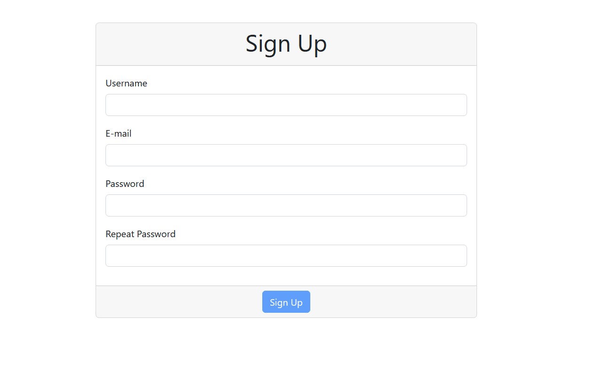

## Progress Indicator

let's slow down the network and try to make multiple requests.
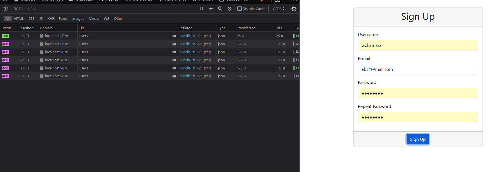
as you can see we are allowing multiple request to the backend.when we have to limit this when we have a already running request.
let's write the test for it.

```jsx
    it('disable the signUp button when there is a ongoing signUp', async () => {
      let counter = 0;

      const server = setupServer(
        rest.post("/api/1.0/users", (req, res, ctx) => {
          counter = counter + 1;
          return res(ctx.status(200))
        })
      );
      server.listen()

      render(<SignUpPage />);

      const usernameInput = screen.getByLabelText('Username');
      const emailInput = screen.getByLabelText('E-mail');
      const passwordInput = screen.getByLabelText('Password');
      const repeatPasswordInput = screen.getByLabelText('Repeat Password');

      userEvent.type(usernameInput, 'username');
      userEvent.type(emailInput, 'abc@gmail.com');
      userEvent.type(passwordInput, 'password');
      userEvent.type(repeatPasswordInput, 'password');

      const button = screen.getByRole('button', { name: 'Sign Up' });

      userEvent.click(button);
      userEvent.click(button);

      await new Promise(resolve => setTimeout(resolve, 500));
      expect(counter).toBe(1);
    });
```

and now the test are failing because we have to add the functionality.

```jsx
// let's add the state
  const [apiProgress, setApiProgress] = useState(false);

// let's set the state 
  const onClick = async (event) => {
    event.preventDefault();
    const body = {
      username: user,
      email,
      password,
    };
    setApiProgress(true);
    await axios.post("/api/1.0/users", body);

  };

  // add the disable logic as well
   <button className="btn btn-primary" disabled={disabled || apiProgress} type="submit" onClick={onClick}>
      Sign Up
    </button>
```

let's refactor our tests

```jsx
describe('interactions', () => {
    let button;
    const setup = () => {
      render(<SignUpPage />);

      const usernameInput = screen.getByLabelText('Username');
      const emailInput = screen.getByLabelText('E-mail');
      const passwordInput = screen.getByLabelText('Password');
      const repeatPasswordInput = screen.getByLabelText('Repeat Password');

      userEvent.type(usernameInput, 'username');
      userEvent.type(emailInput, 'abc@gmail.com');
      userEvent.type(passwordInput, 'password');
      userEvent.type(repeatPasswordInput, 'password');

      button = screen.getByRole('button', { name: 'Sign Up' });
    }
    it('enables the button when the password and repeat password match', () => {
      
      setup();
      
      expect(button).not.toBeDisabled();
    });

    it('send username, password, email to the backend', async () => {
      let requestBody;
      const server = setupServer(
        rest.post("/api/1.0/users", (req, res, ctx) => {
          requestBody = req.body;
          return res(ctx.status(200))
        })
      );
      server.listen();

      setup();
      
      userEvent.click(button);
      await new Promise(resolve => setTimeout(resolve, 500))
      expect(requestBody).toEqual({
        username: 'username',
        email: 'abc@gmail.com',
        password: 'password',
      });
    });

    it('disable the signUp button when there is a ongoing signUp', async () => {
      let counter = 0;

      const server = setupServer(
        rest.post("/api/1.0/users", (req, res, ctx) => {
          counter = counter + 1;
          return res(ctx.status(200))
        })
      );
      server.listen()

      setup();

      userEvent.click(button);
      userEvent.click(button);

      await new Promise(resolve => setTimeout(resolve, 500));
      expect(counter).toBe(1);
    });
  });
  ```

let's add a progress bar to the signup button.
let's write a test first.

```jsx
    it('display spinner after clicking the submit', async () => {

      const server = setupServer(
        rest.post("/api/1.0/users", (req, res, ctx) => {
          return res(ctx.status(200))
        })
      );
      server.listen();

      setup();

      expect(screen.queryByRole('status')).not.toBeInTheDocument();

      userEvent.click(button);
      const spinner = screen.getByRole('status');
      expect(spinner).toBeInTheDocument();

    });
```

now let's add the spinner

```jsx
    <button className="btn btn-primary" disabled={disabled || apiProgress}              type="submit" onClick={onClick}>
      {
        apiProgress && <span className="spinner-border spinner-border-sm" role="status"></span>
      }
      Sign Up
    </button>
```

## Layout - Sign Up Success

let'a add a success message after a successful signup.

```jsx
 it('displays account activation notification after the successful signup request', async () => {

      const server = setupServer(
        rest.post("/api/1.0/users", (req, res, ctx) => {
          return res(ctx.status(200))
        })
      );
      server.listen();

      setup();
      const message = "Please check your email to activate the account";
      expect(screen.queryByText(message)).not.toBeInTheDocument();
      userEvent.click(button);
      const text = await screen.findByText(message);
      expect(text).toBeInTheDocument();
    });
```

now the tests are failing we have to add the implementation.

```jsx
const [signUpSuccess, setSignUpSuccess] = useState(false);

const onClick = async (event) => {
  event.preventDefault();
  const body = {
    username: user,
    email,
    password,
  };
  setApiProgress(true);
  const response = await axios.post("/api/1.0/users", body);
  if (response) {
    setSignUpSuccess(true)
  };
};

</form>
    {
      signUpSuccess && <div className="alert alert-success mt-3" >Please check your email to activate the account</div>
    }
</div>
```

let's change to hide the form after a successful signUp.
let's write the test first.

```jsx
 it("hides the signUp form after successful signup request", async () => {
      const server = setupServer(
        rest.post("/api/1.0/users", (req, res, ctx) => {
          return res(ctx.status(200))
        })
      );
      server.listen();

      setup();

      const form = screen.getByTestId('form-sign-up');
      userEvent.click(button);

      // we can use this or
      await waitFor(() => {
        expect(form).not.toBeInTheDocument();
      })
      // we can use this.
      // await waitForElementToBeRemoved(form)
    })
```

let's implement this.

```jsx
 {!signUpSuccess && <form className="card mt-5" data-testid="form-sign-up" >
        .... form content
      </form>}

```

## Refactor - Test Lifecycle Async Await

let's refactor our tests.

```jsx
  describe('interactions', () => {
    let requestBody;
    let counter = 0;

    const server = setupServer(
      rest.post('/api/1.0/users', (req, res, ctx) => {
        requestBody = req.body;
        counter = counter + 1;
        return res(ctx.status(200));
      })
    );

    beforeEach(() => {
      counter = 0;
    });

    beforeAll(() => server.listen());

    afterAll(() => server.close());

    let button;

    const setup = () => {
      render(<SignUpPage />);

      const usernameInput = screen.getByLabelText('Username');
      const emailInput = screen.getByLabelText('E-mail');
      const passwordInput = screen.getByLabelText('Password');
      const repeatPasswordInput = screen.getByLabelText('Repeat Password');

      userEvent.type(usernameInput, 'username');
      userEvent.type(emailInput, 'abc@gmail.com');
      userEvent.type(passwordInput, 'password');
      userEvent.type(repeatPasswordInput, 'password');

      button = screen.getByRole('button', { name: 'Sign Up' });
    };

    it('enables the button when the password and repeat password match', () => {
      setup();

      expect(button).not.toBeDisabled();
    });

    it('send username, password, email to the backend', async () => {
      setup();

      userEvent.click(button);

      await screen.findByText(
        'Please check your email to activate the account'
      );

      expect(requestBody).toEqual({
        username: 'username',
        email: 'abc@gmail.com',
        password: 'password',
      });
    });

    it('disable the signUp button when there is a ongoing signUp', async () => {
      setup();

      userEvent.click(button);
      userEvent.click(button);

      await screen.findByText(
        'Please check your email to activate the account'
      );

      expect(counter).toBe(1);
    });

    it('display spinner after clicking the submit', async () => {
      setup();

      expect(screen.queryByRole('status')).not.toBeInTheDocument();

      userEvent.click(button);

      const spinner = screen.getByRole('status');

      expect(spinner).toBeInTheDocument();
      // here we are waiting until the text appear on the dom
      await screen.findByText(
        'Please check your email to activate the account'
      );
    });

    it('displays account activation notification after the successful signup request', async () => {
      setup();

      const message = 'Please check your email to activate the account';

      expect(screen.queryByText(message)).not.toBeInTheDocument();

      userEvent.click(button);

      const text = await screen.findByText(message);

      expect(text).toBeInTheDocument();
    });

    it('hides the signUp form after successful signup request', async () => {
      setup();

      const form = screen.getByTestId('form-sign-up');

      userEvent.click(button);

      // we can use this or
      await waitFor(() => {
        expect(form).not.toBeInTheDocument();
      });
      // we can use this.
      // await waitForElementToBeRemoved(form)
    });
  });
});

```

and the implementation as well

```jsx
const onClick = async (event) => {
    event.preventDefault();
    const body = {
      username: user,
      email,
      password,
    };
    setApiProgress(true);
    try {
      await axios.post('/api/1.0/users', body);
      setSignUpSuccess(true);
    } catch (error) { }
  };
