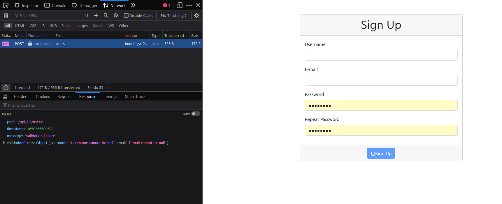

# Validation

- [Validation](#validation)
  - [Displaying Validation Errors](#displaying-validation-errors)
  - [Enable Button After Validation Error](#enable-button-after-validation-error)
  - [Mock Service Worker - Override Handler](#mock-service-worker---override-handler)
  - [Component - Input](#component---input)
  - [Styling Input](#styling-input)
  - [Displaying Errors for Remaining Inputs](#displaying-errors-for-remaining-inputs)
  - [Client-side Validation](#client-side-validation)
  - [Hiding Errors](#hiding-errors)

## Displaying Validation Errors

Let’s enter data without username and e-mail.



```jsx
 it("displays validation message for username", async () => {
      server.use(
        rest.post('/api/1.0/users', (req, res, ctx) => {
          return res(ctx.status(400), ctx.json({
            validationErrors: {
              username: "Username cannot be null"
            }
          }));
        })
      )
      setup();

      userEvent.click(button);

      const validationMessage = await screen.findByText("Username cannot be null");
      expect(validationMessage).toBeInTheDocument();
    })
```

Here we are using.Server use use method to override.
Here we are calling the rest of pause method again.So it will override the default rest method.

This is failing.

Now let’s fix it.
Let's add a state for errors

```jsx
const [errors, setErrors] = useState({});
```

And implement The.Validation errors Inside the axios Post Method.

```jsx
  const onClick = async (event) => {
    event.preventDefault();
    const body = {
      username: user,
      email,
      password,
    };
    setApiProgress(true);
    try {
      await axios.post('/api/1.0/users', body);
      setSignUpSuccess(true);
    } catch (error) {
      if (error.response.status === 400) {
        setErrors(error.response.data.validationErrors);
      }
    };
  }
```

Let's add Error message to the user input.

```jsx
  <label className='form-label' htmlFor='username'>
                Username
              </label>
              <input
                className='form-control'
                id='username'
                onChange={onChange}
              />
              <span>{errors?.username}</span>
  .....
```

## Enable Button After Validation Error

## Mock Service Worker - Override Handler

## Component - Input

## Styling Input

## Displaying Errors for Remaining Inputs

## Client-side Validation

## Hiding Errors
